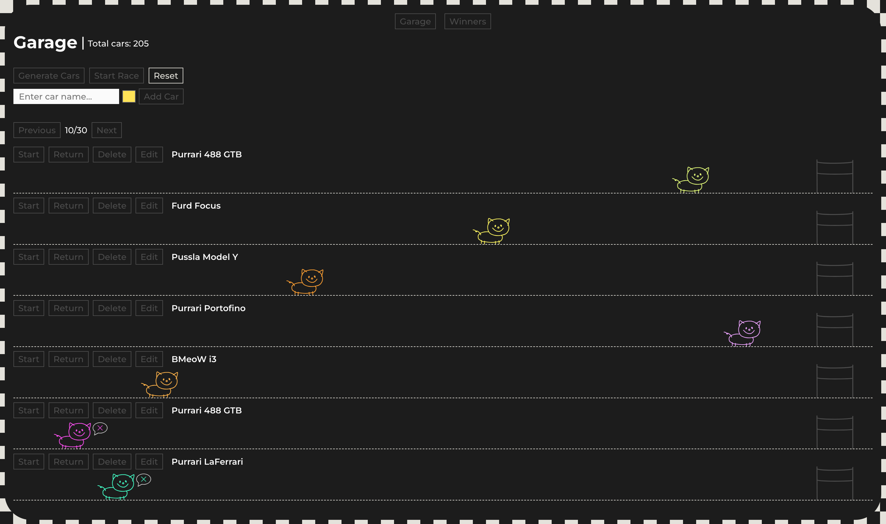

# Async Race

Async Race is a single-page application for managing a collection of cars, controlling their engines, and tracking races. Users can perform full CRUD operations on cars, specifying their names and colors, and control car engines with smooth start/stop animations. The race controls include the ability to start and reset a race. The Winners view offers sorting and pagination by the number of wins and best race times. The interface is fully responsive down to screen widths of 500px. The app uses a ready-made backend server provided separately.

**Rolling Scopes School Task** — Stage 2: [Async Race](https://github.com/rolling-scopes-school/tasks/tree/master/stage2/tasks/async-race)

## Demo



## Local Setup

```bash
git clone https://github.com/asfound/async-race.git
npm install
npm run dev
```
